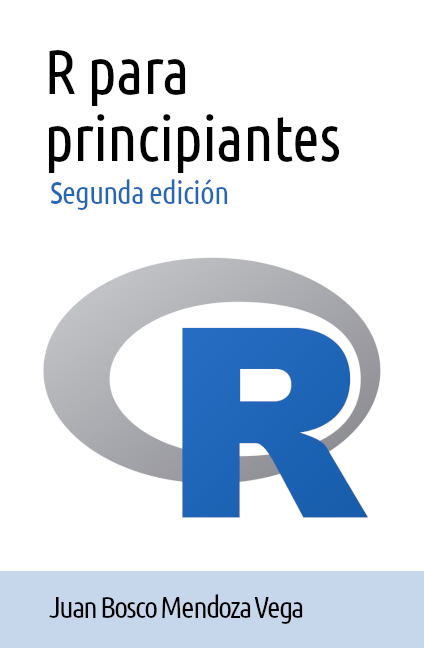

# Prefacio {.unnumbered}

{width="50%" fig-align="center"}

## Propósito del libro

*R para principiantes* pretende ser un materal introductorio al lenguaje de programación R, dirigído a personas que nunca han usado R o ningún otro lenguaje de programación, ni tiene conocimiento previo de probabilidad y estadística.

Este libro tiene como propósito que adquieras los fundamentos del uso de R como un lenguaje de programación, desde sus conceptos más elementales, hasta la definición de funciones y generación de gráficos.

No son objetivos de este libro que aprendas probabilidad y estadística, ni las aplicaciones espécificas de estas disciplinas, tales como son *data science*, aprendizaje automático, econometría, psicometría, bioestadística u otros.

En el [capítulo @sec-consulta] de este libro se presenta una lista de recursos que puedes consultar en caso de tener interés por alguno de estos temas.

Se espera que al concluir este libro:

-   conozcas las características principales de R
-   identifiques operaciones, tipos y estructuras de datos
-   utilices los tipos y estructuras de datos en operaciones
-   definas sus propias funciones
-   importes y exportes datos
-   generes y exportes gráficos

El código para generar este libro se encuentra en Github:

- <https://github.com/jboscomendoza/r-principiantes-2ed>

## Acerca del autor

*Juan Bosco Mendoza Vega* es usuario de R desde el 2014.

Es maestro en psicología por la Universidad Nacional Autónoma de México (UNAM). Especialista en evaluación educativa y psicometría, dedicado a la evaluación del aprendizaje y de programas educativos, así como a la aplicación del análisis de datos y  los métodos cuantitativos para el estudio de las ciencias sociales.

Ha colaborado en los Comités Interinstitucionales para la Evaluación de la Educación Superior (CIEES) como elaborador de informes de evaluación institucional y como consultor independiente en análisis de datos y psicomeetría para INNOVA Schools, el Centro Nacional de Evaluación para la Educación Superior (CENEVAL), The World Bank Group y el Banco Interamericano de Desarrollo (BID).

Trabajó en el Institucional para la Evaluación de la Educación (INEE) del 2014 al 2019 y para la Comisión Nacional para la mejora de la Educación del 2022 al 2025 en las áreas de evaluación del aprendizaje y de evaluación de la oferta educativa, así como Data Scientist y psicómetra en Mindful del 2019 al 2021.

Actualmente trabaja como analista cuantitativo en Vía Educación.

Puedes visitar el sitio personal del autor en el siguiente enlace:

- <http://boscomendoza.com>

Tambien puedes encontrar el repositorio público de Github del autor en el siguiente enlace:

- <https://github.com/jboscomendoza>